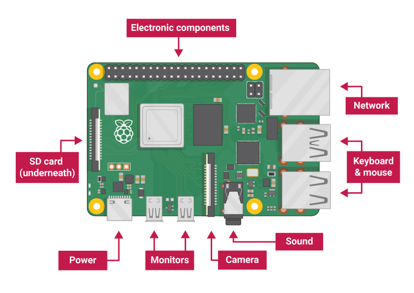

# Topics
## Hardware
- Raspberry pi
  - Pico
  - Zero
  - 4B
    

- Arduino
  - Uno
  - Nano
  - Mega
- ESP Series
  - ESP CH340
  - ESP CP2102
## Software
### Languages
- C
- C++
- MicroPython
- Ada
### IDEs
- Arduino IDE

### Raspberry Pi Operating Systems
- Windows for ARM
- Raspberry Pi OS
- Android 13 (Through Lineage OS 20)

## Sensors and Modules
- Relay
- Temperature
- Humidity
- Photoresistor
- Gas
- Infrared
- Ultrasonic
- Motion Sensor
- Vibration
- Gyroscope
- Accelerometer
- Mercury Switch
- Touch Module
- Fingerprint
- Radio Frequency Identification (RF ID)
- Micro SD card module
- Voltage Sesnsor
- Water flow sensor
- Soil moisture sensor
- Heartbeat/pulses sensor
- Metal detector 
- Knock sensor
- Water level depth sensor