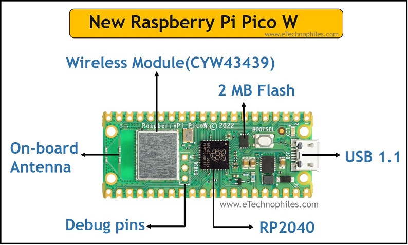
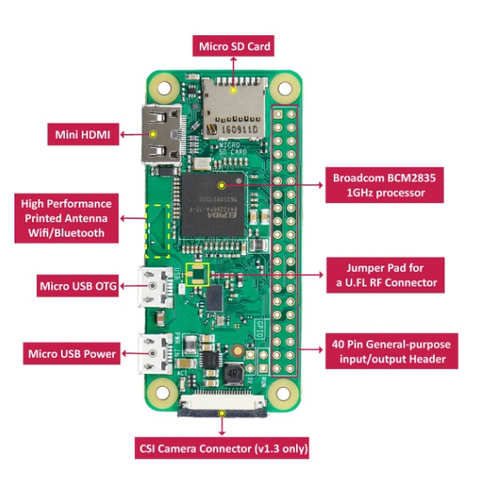
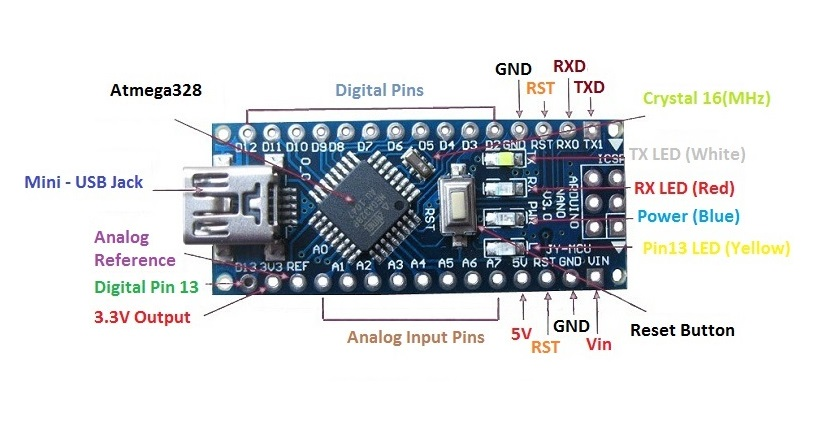

## Hardware
- Raspberry pi
  - Pico
    
  - Zero
    
  - 4B
    

- Arduino
  - Uno
    
  - Nano
    
  - Mega
    

- ESP Series
  - ESP CH340
  - ESP CP2102

### Processor Architecture
Most microcontrollers and Single-board-computers like the raspberry pi have ARM based SoCs (System on Chip), unlike regular computers that use x86_64/AMD64 architecture.

The advantages of ARM are as follows:
- Low power consumption
- Low heat
- Easier to develop as the instruction set is simpler
- Cheaper to develop as the instruction set is open source

## Software
### Languages
- C
- C++
- MicroPython
- Ada

### IDEs
- Arduino IDE
- Thonny IDE

### Raspberry Pi Operating Systems
- Windows for ARM
- Raspberry Pi OS
- Android 13 (Through Lineage OS 20)

## Sensors and Modules
- Relay
- Temperature
- Humidity
- Photoresistor
- Gas
- Infrared
- Ultrasonic
- Motion Sensor
- Vibration
- Gyroscope
- Accelerometer
- Mercury Switch
- Touch Module
- Fingerprint
- Radio Frequency Identification (RF ID)
- Micro SD card module
- Voltage Sesnsor
- Water flow sensor
- Soil moisture sensor
- Heartbeat/pulses sensor
- Metal detector 
- Knock sensor
- Water level depth sensor